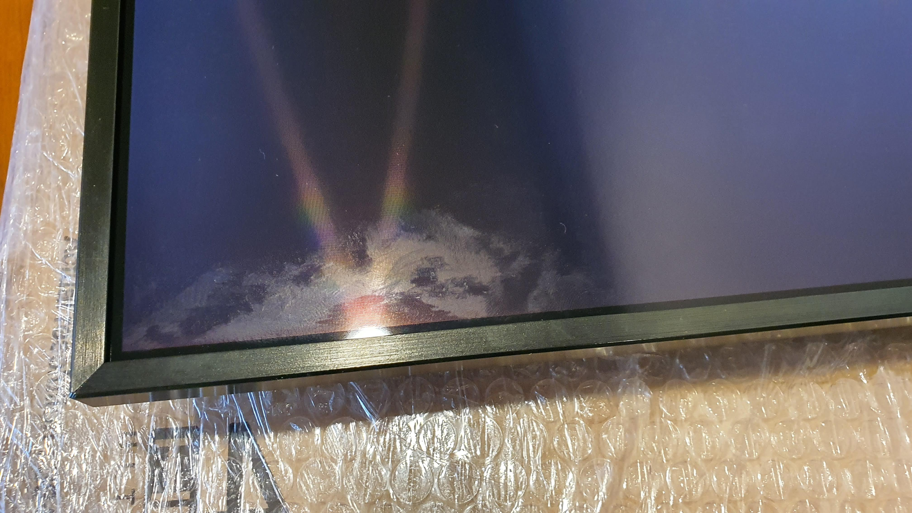
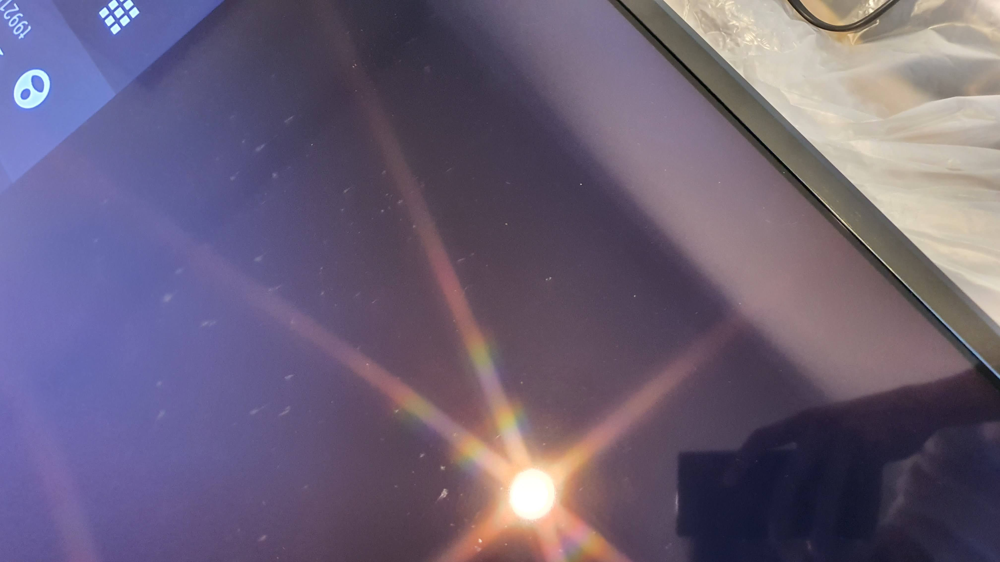
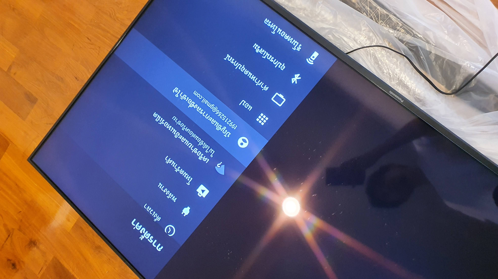
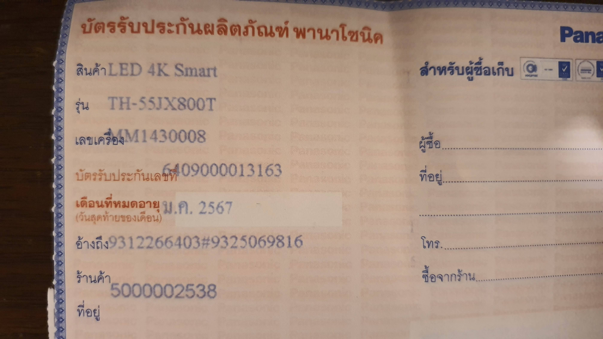
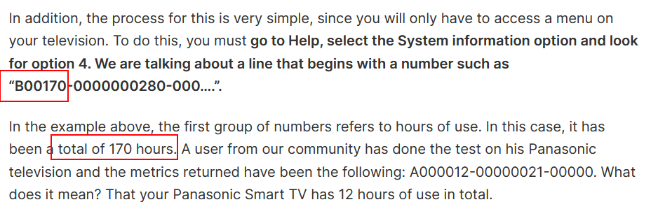
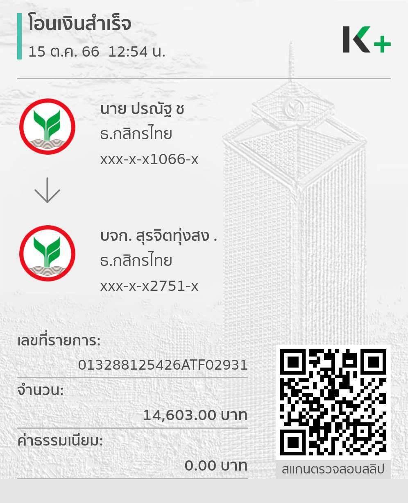
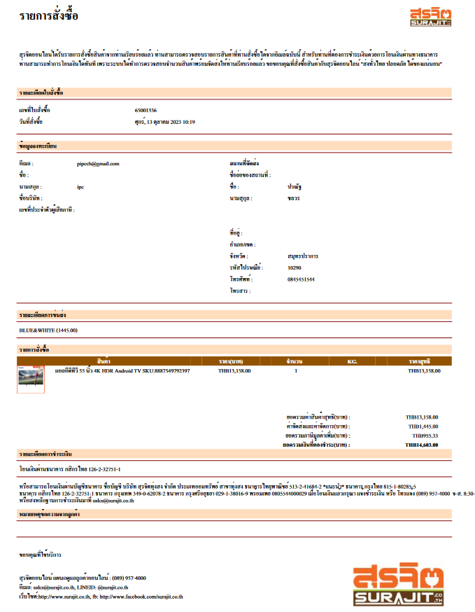

# ร้าน สุรจิต surajit.co.th "หลอก" ขายทีวีตัวโชว์ โดยไม่แจ้งให้ลูกค้าทราบ

## รายละเอียดเหตุการณ์

### เหตุการณ์ก่อนสั่งซื้อ

#### การพูดคุยก่อนสั่งซื้อ ร้านไม่ได้แจ้งว่าสินค้าเป็นตัวโชว์

##### อ้างอิง

- [[1] แชทการพูดคุยทางไลน์ ตั้งแต่วันที่ 12/10/2023 - 15/10/2023](#1-แชทการพูดคุยทางไลน์-ระหว่าง-สุรจิต-surajitcoth-กับ-pipe)

#### หน้าเว็บไซต์ ร้านไม่ได้แจ้งว่าสินค้าเป็นตัวโชว์

##### อ้างอิง

- [[2] Screen Shot หน้าเว็บไซต์ วันที่ 19/10/2023](#2-screen-shot-หน้าเว็บไซต์-วันที่-19102023)

### เหตุการณ์หลังจากได้รับสินค้าแล้ว

#### ทีวีที่ได้รับเป็นสินค้าตัวโชว์

- มีร่องรอยเต็มหน้าจอ

- ทีวีมีการล๊อคอิน

- ประกันเหลือ 3 เดือน

- เมื่อตรวจสอบ พบว่าทีวีมีอายุการใช้งานกว่า 1,700 ชม.

##### อ้างอิง

- [[3] ข้อมูลของสินค้าตัวโชว์ (ภาพ และวิธีการตรวจสอบ)](#3-ข้อมูลของสินค้าตัวโชว์-ภาพ-และวิธีการตรวจสอบ)

#### เมื่อสอบถาม ร้านโกหก ว่าเป็นสินค้าตัวโชว์ที่ไม่เคยใช้งาน

เมื่อสอบถาม ร้านแจ้งว่า "เป็นการทดสอบทีวี"

```
16:04 สุรจิต surajit.co.th สอบถามทางพนักงานแล้วนะคะ พนักงานใส่ถ่านรีโมทและมาการล้อคอินเข้าเพื่อทดสอบทีวีให้คะ

16:05 สุรจิต surajit.co.th ขอโทษด้วยคะ ที่แจ้งให้ครบถ้วน ทางร้านได้ใช้งานทีวีเพื่ออย่างอื่นนะคะ

16:05 สุรจิต surajit.co.th เป็นการทดสอบทีวี ทั้งหน้าร้านและส่งออนไลน์คะ
```

##### อ้างอิง

- [[1] แชทการพูดคุยทางไลน์ วันที่ 19/10/2023 เวลา 16:04](#1-แชทการพูดคุยทางไลน์-ระหว่าง-สุรจิต-surajitcoth-กับ-pipe)

## หลักฐานอ้างอิง

### [1] แชทการพูดคุยทางไลน์ ระหว่าง "สุรจิต surajit.co.th" กับ "Pipe"

```
### 2023.10.12 Thursday

22:33 Pipe https://www.surajit.co.th/vmart/shop/ทีวีแอลอีดี-50-90-นิ้ว/PANASONIC-TH-55JX800T/416-20616

22:33 สุรจิต surajit.co.th ช่วงเวลา 19:00-8:30 น. ในวันจันทร์-วันเสาร์ และช่วงเวลา 17:30-8:30 น. ในวันอาทิตย์ เป็นช่วงเวลาปิดทำการ ขออภัยในความไม่สะดวกด้วยนะค่ะ หากลูกค้าต้องการชำระเงิน สามารถโอนเงินมาได้ที่เลขที่บัญชี 513-2-41684-2 ธนาคารไทยพาณิชย์ ชื่อบัญชี บริษัท สุรจิตทุ่งสง จำกัด แล้วส่งหลักฐานการโอนเงินมาทิ้งไว้ทางไลน์ เมื่อถึงเวลาทำการทางร้านจะติดต่อกลับทันทีค่ะ (moon big smile) ส่วนถ้าต้องการสอบอะไหล่โปรดถ่ายรูปฉลากสินค้าที่มีรุ่นสินค้าปรากฏอยู่เพิ่มเติม และแจ้งชื่อ-นามสกุล เบอร์โทรและที่อยู่จัดส่งพร้อมรหัสไปรษณีย์

22:34 Pipe ถ้าสินค้ามีปัญหาต้องเคลมอย่างไรบ้างครับ

22:34 สุรจิต surajit.co.th ช่วงเวลา 19:00-8:30 น. ในวันจันทร์-วันเสาร์ และช่วงเวลา 17:30-8:30 น. ในวันอาทิตย์ เป็นช่วงเวลาปิดทำการ ขออภัยในความไม่สะดวกด้วยนะค่ะ หากลูกค้าต้องการชำระเงิน สามารถโอนเงินมาได้ที่เลขที่บัญชี 513-2-41684-2 ธนาคารไทยพาณิชย์ ชื่อบัญชี บริษัท สุรจิตทุ่งสง จำกัด แล้วส่งหลักฐานการโอนเงินมาทิ้งไว้ทางไลน์ เมื่อถึงเวลาทำการทางร้านจะติดต่อกลับทันทีค่ะ (moon big smile) ส่วนถ้าต้องการสอบอะไหล่โปรดถ่ายรูปฉลากสินค้าที่มีรุ่นสินค้าปรากฏอยู่เพิ่มเติม และแจ้งชื่อ-นามสกุล เบอร์โทรและที่อยู่จัดส่งพร้อมรหัสไปรษณีย์

### 2023.10.13 Friday

09:01 สุรจิต surajit.co.th รับประกันตัวสินค้า 2 ปี
หลังลงทะเบียนได้รับประกัน 3 ปี

09:05 Pipe ถ้าสินค้ามีปัญหาต้องเคลมอย่างไรบ้างครับ

09:28 สุรจิต surajit.co.th ลูกค้าอยู่ที่ไหนคะ

09:35 Pipe แถวๆ กรุงเทพ พระประแดงครับ

09:36 สุรจิต surajit.co.th ส่งเข้าศูนย์พานาได้ทั่วประเทศนะคะ

09:49 Pipe ถ้ามีปัญหาใน 7 วันก็ศูนย์ ใช่ไหมครับ

09:51 สุรจิต surajit.co.th 7 วันแจ้งทางร้านได้เลยคะ

09:51 สุรจิต surajit.co.th เกิน7วันรับประกันศูนย์นะคะ

10:09 Pipe ถ้าจะซื้อต้องทำอย่างไรบ้างครับ

10:10 Pipe '

10:10 Pipe [ ภาพ สินค้า จากหน้าเว็บ ]

10:11 สุรจิต surajit.co.th สั่งครั้งแรกลงทะเบียนล็อคอินผ่านไลน์ก่อนนะคะ

10:21 สุรจิต surajit.co.th ได้รับออเดอร์เรียบร้อยแล้วนะคะ

10:23 สุรจิต surajit.co.th จัดส่งรอบวันจันทร์นะคะ เนื่องจากขนส่งปิดทำการ 2วันคะ

10:24 Pipe อ่อออ

10:24 Pipe ถ้าต้องการรอบวันจันทร์ โอนช้าสุดวันไหนครับ

10:25 สุรจิต surajit.co.th โอนได้เลยนะคะ เพราะทีวี มี1 ตัวคะ

10:27 สุรจิต surajit.co.th สินค้าตัวหใ่พร้อมส่งนะคะ

10:27 สุรจิต surajit.co.th แจ้งสลิปผ่านทางไลน์ได้เลยคะ

10:28 Pipe ขออนุญาตโอนเป็นพรุ่งนี้เช้าได้ไหมครับ

10:30 สุรจิต surajit.co.th พรุ่งนี้ร้านปิด 1 วันคะ

10:30 สุรจิต surajit.co.th ลูกค้าแจ้งโอนมาได้เลยนะคะ
แอดมินจะมารับออเดอร์ให้วันอาทิตย์คะ

10:34 Pipe ขอบคุณมากครับ

10:34 สุรจิต surajit.co.th Stickers

## 2023.10.15 Sunday

09:12 สุรจิต surajit.co.th ลูกค้าแจ้งโอนมารึยังคะ

11:21 Pipe โอน​ตอนนี้​ทัน​ไหม​ครับ​ หรือ​ว่า​ต้อง​กด​ซื้อ​ใหม่​ครับ

11:27 สุรจิต surajit.co.th ตอนนี้ได้คะ

11:28 สุรจิต surajit.co.th ยอดโอนตามรายการสั่งซื้อได้เลยนะคะ

12:54 Pipe [ สลิปการโอนเงิน ]

12:56 สุรจิต surajit.co.th ขอบคุณคะ ส่งสินค้ารอบพรุ่งนี้นะคะ

12:56 Pipe ขอบคุณ​ครับ

12:56 Pipe Stickers

## 2023.10.16 Monday

11:23 สุรจิต surajit.co.th EP126610160001

11:24 สุรจิต surajit.co.th แจ้งเลขพัสดุขนส่งบลูแอนไวท์คะ

11:26 Pipe Stickers

11:31 สุรจิต surajit.co.th Stickers

## 2023.10.18 Wednesday

11:54 Pipe ปกติสถานะบิล จะมีอัพเดทไหมครับ หรือว่ารู้ตัวอีกทีคือถึงเลยครับ

11:54 Pipe [ ภาพ สถานะการส่งสินค้า ไม่อัพเดท ]

## 2023.10.19 Thursday

09:04 สุรจิต surajit.co.th จะมีขนส่งติดต่อไปก่อนคะ

15:43 Pipe [ ภาพจอที่มีรอยเลอะ จำนวนมาก + ภาพทีวีมีการ Login ]

15:43 Pipe นี่​มัน​ตัว​โชว์​นี่​ครับ

15:44 Pipe Login แล้ว
จอมีรอย
ถ่านรีโมตแกะแล้ว

15:59 สุรจิต surajit.co.th ใช่คะ ก่อนนห้าเเอดมินแจ้ง สินค้าเหลือ1 ตัว

16:00 สุรจิต surajit.co.th ใช่คะ ก่อนนหน้าเเอดมินแจ้ง สินค้าเหลือ1 ตัว คะ

16:00 Pipe เหลือ 1 ตัว ไม่ได้แปลว่าเป็นตัวโชว์ครับ

16:01 สุรจิต surajit.co.th สินค้าเป็นตัวโชว์ที่ไม่ได้นำมาใช้งานคะ พนักงานแจ้งไว้แล้วคะ ว่ามีการล็อคอินอีเมลล์ไว้

16:02 Pipe ช่วย cap ให้ดูหน่อยครับ ว่ามีการแจ้งว่าเป็นตัวโชว์ หรือมีการล๊อคอินอีเมล์ไว้

16:03 Pipe ร้านทำมาค้าขายไม่ซื่อสัตย์เลยนะครับ

16:04 สุรจิต surajit.co.th สอบถามทางพนักงานแล้วนะคะ พนักงานใส่ถ่านรีโมทและมาการล้อคอินเข้าเพื่อทดสอบทีวีให้คะ

16:05 สุรจิต surajit.co.th ขอโทษด้วยคะ ที่แจ้งให้ครบถ้วน ทางร้านได้ใช้งานทีวีเพื่ออย่างอื่นนะคะ

16:05 สุรจิต surajit.co.th เป็นการทดสอบทีวี ทั้งหน้าร้านและส่งออนไลน์คะ

16:05 Pipe ถ้าผมพิสูจน์ได้ว่าทีวีเครื่องนี้ถูกเปิดมาแล้ว xxx ชม
ร้านจะรับผิดชอบอย่างไรครับ

16:06 สุรจิต surajit.co.th แต่ทีวีเป็นรอยอันนี้ทางร้านให้พนักงานตรวจสอบก่อนนะคะ

16:13 สุรจิต surajit.co.th ลูกค้าลองเปิดดูก่อนนะเป็นรอยแตกมั้ยคะ

16:14 Pipe ไม่เป็นรอยแตกครับ

16:14 Pipe ถ้าผมพิสูจน์ได้ว่าทีวีเครื่องนี้ถูกเปิดมาแล้ว xxx ชม
ร้านจะรับผิดชอบอย่างไรครับ

16:19 สุรจิต surajit.co.th ต้องขอโทษด้วยนะคะ เนื่องจากวันที่แจ้งลูกค้า สินค้ามีเพียง 1 ตัวคะ ซึ่งเป็นตัวโชว์ เป็นการเปิดสาธิตเท่านั้นและหน้าจอคะ ทางร้านตรวจสอบเป็นอย่างดีสินค้าไม่ได้มีรอย ซึ่งอาจจะเป็นรอยที่เกิดจาการยกจากขนส่งคะ

16:20 สุรจิต surajit.co.th ทางร้านต้องขอโทษเป็นอย่างสูงที่ได้แจ้งให้ละเอียด

16:20 สุรจิต surajit.co.th ขอโทษด้วยคะ

16:20 Pipe เหลือ 1 ตัว ไม่ได้แปลว่าเป็นตัวโชว์ครับ

16:21 Pipe รอยก็ไม่ได้เกิดจากการขนส่งครับ
รอยมันอยู่ที่จอ ไม่ได้อยู่ที่กล่องครับ

16:22 Pipe ผมต้องการคืนสินค้าครับ
เนื่องจากร้านไม่ได้แจ้งว่าสินค้าที่ผมซื้อเป็นสินค้าตัวโชว์
อีกทั้งสินค้าเป็นทีวีที่ออกมานานแล้ว จะต้องมีการเปิดโชว์อย่างยาวนานทำให้อายุการใช้งานลดลง อย่างมีนัยยะสำคัญ

16:24 สุรจิต surajit.co.th ลูกค้ามีวีดิโอ ตอนแกะมั้ยคะ เพราะตอนแพ็คสินค้าทางร้านเช็คอย่างดีคะ ไม่มีรอย

16:27 Pipe ไม่มีครับ

16:27 Pipe ตอนนี้ผมไม่ได้พูดถึงรอยครับ
ผมพูดถึงความเสี่อมของการใช้งาน
เนื่องจากทีวีเป็นตัวโชว์ครับ

16:30 สุรจิต surajit.co.th ได้คะ ลูกค้าคืนสินค้าได้คะ สินค้าคืนในสภาพเดิมอุปกรณ์ครบ กล่องสภาพเดิมนะคะ ทางร้านยินดีให้คืนคะ โดยสินค้าที่คืนมาจะต้องไม่แตกและชำรุดนะคะ

16:31 สุรจิต surajit.co.th หากลูกค้าไม่คืนทางร้านยินดี ส่งของสมนาคุณคะ

16:32 Pipe ของสมนาคุณคืออะไรครับ

16:34 สุรจิต surajit.co.th ผ้านวม 1 ชุดคะ

16:35 สุรจิต surajit.co.th และหมวกกันน็อคคะ

16:36 Pipe ขอคืนสินค้าครับ

16:36 Pipe ขั้นตอนเป็นอย่างไรบ้างครับ

16:40 สุรจิต surajit.co.th คืนมาที่ร้านตามที่อยู่ บจก. สุรจิตทุ่งสง 500 ถ.ชนปรีดา ต.ปากแพรก อ.ทุ่งสง จ.นครศรีฯ 80110 โทร.0899574000 หลังจากสินค้าถึงร้าน ทางร้านเช็คหมายเลขเครื่อง หน้าจอ กล่อง คะ รอคืนเงิน 1-2วันทำการบัญชีทำการคืนให้คะ ทางร้านคืนเฉพาะค่าสินค้านะคะ

16:41 Pipe ผมถูกโกหก และยังต้องเสียค่าจัดส่งไปมา
เท่ากับผมน่าจะเสียค่าโง่ประมาณ 3,000 บาท
ผมเข้าใจถูกใช่ไหมครับ

16:47 สุรจิต surajit.co.th [ ภาพแคปหน้าจอแชท "โอนได้เลยนะคะ เพราะทีวี มี1 ตัวคะ" ]

16:47 Pipe [ ภาพแคปหน้าจอแชท "เหลือ 1 ตัว ไม่ได้แปลว่าเป็นตัวโชว์ครับ" ]

16:49 สุรจิต surajit.co.th ทางร้านไม่ได้โกหกคะ ทางร้านแจ้งไปแล้ว ว่า สินค้าเหลือเพียง 1 ตัว ต้องขอโทษด้วยที่ไม่ได้แจ้งรายละเอียดอธิบายให้ชัดเจน ลูกค้าคืนได้เลยคะ ทางร้านคืนเงินให้เต็มจำนวนคะ

16:49 Pipe รวมค่าส่งทั้งสองรอบด้วยใช่ไหมครับ

16:52 สุรจิต surajit.co.th เป็นค่าส่งรอบเดียวที่ลูกค้าโอนมานะคะ

16:55 Pipe ร้านช่วยเรียกขนส่งมารับได้ไหมครับ
ผมไม่ได้มีความสุขกับการเถียงกับร้านเลย
ตอนแรกที่สั่งก็คิดว่าเป็นร้านที่ดังและมีชื่อเสียงพอสมควร
ก็เลยไม่ได้ถามเยอะ และก็ไม่ได้คิดว่าจะเอาตัวโชว์ มาขายโดยไม่บอกกันแบบนี้
จะได้จบเรื่องกันครับ

17:01 สุรจิต surajit.co.th ทางร้านขอโทษอีกครั้งคะที่ไม่ได้สื่อสารให้ชัดเจน เดี๋ยวทางร้านสอบถามขนส่งก่อนนะคะ

17:13 สุรจิต surajit.co.th ทางร้านสอบถามขนส่งแล้วคะ ทางขนส่งแจ้งให้ลูกค้า แจ้งขนส่งด้วยตนเองเนื่องจากต้องใช้บัตรประชาชนลูกค้าด้วยคะ

18:58 Pipe [ ภาพใบประกัน สินค้าหมดอายุประกันเดือน มกราคม 2567 ]

18:59 Pipe ประกันเหลือ​ 3 เดือน

## 2023.10.20 Friday
08:49 สุรจิต surajit.co.th สอบถามพนักงานขายแล้วคะ ใบรับประกันจะไม่มีผลต่อการการรับประกันสินค้าคะ เพราะจะเช็คกับหมายเลขเครื่องในระบบจะลงหมายเลขเครื่องไว้คะ พนักงานจะต่อประกันให้ลูกค้าคะเพิ่ม 1ปีคะ แต่หากลูกค้าจะคืนพนักงานจะยังไม่ลงคะ

08:59 Pipe ต่อเพิ่ม 1 ปี เท่ากับ 1 ปี 3 เดือนใช่ไหมครับ

09:00 Pipe ซึ่งไม่ตรงกับที่ได้แจ้งไว้ว่า
รับประกันตัวสินค้า 2 ปี
หลังลงทะเบียนได้รับประกัน 3 ปี

09:04 Pipe นี่ผมคุยกับเจ้าของร้านอยู่หรือเปล่าครับ

09:05 สุรจิต surajit.co.th แอดมินคะ กำลังสอบถามพนักงานคะ สักครู่นะคะ

09:08 Pipe
https://docs.google.com/document/d/1zNZpXaMP58cbgJmejW1YNcxv6Sxx7GdB9u25PSOKY2c/edit

1) ทีวีเปิดมาแล้ว 1,734 ชม
2) เป็นทีวีตัวโชว์
3) รอยเต็มหน้าจอ

09:10 Pipe ผมต้องการคืนสินค้า โดยร้านออกค่าขนส่งกลับให้ครับ
ถ้าไม่ได้ ผมจะดำเนินการตามขั้นตอนของกฎหมาย
เงื่อนไข
- ร้านดำเนินการและ**ออกค่าขนส่งขากลับ**
- ร้านโอนเงินคืนผมภายในวันนี้ (เนื่องจากร้านโกหก และหลอกลวงผมหลายรอบแล้ว)

09:10 Pipe รบกวนแจ้งเจ้าของร้านด้วยครับ

09:10 สุรจิต surajit.co.th พนักงานเพิ่มประกันให้ลูกค้าอีก 1 ปี คะ ประกันตัวสินค้าทั้งหมด 3 ปีคะ ตามนโยบายของบริษัทพานาโซนิค

09:11 Pipe ผมต้องการคืนสินค้า เหมือนเดิมตามด้านบนครับ

09:15 สุรจิต surajit.co.th ทางร้านต้องขอโทษลูกค้าเป็นอย่างสูงคะ ที่ไม่ได้อธิบายข้อมูลให้ชัดเจนแจ้งเพียง เหลือทีวี1 ตัว การโอนเงินคืนลูกค้าทั้งหมดหลังจากที่ได้รับสินค้าคืน1-2วัน ให้บัญชีรีบดำเนินการให้นะคะ

09:15 สุรจิต surajit.co.th ขอโทษเป็นอย่างสูงคะ

09:17 Pipe ถ้าผมต้องพิมพ์ซ้ำอีกครั้ง ผมจะไม่คุยแล้วนะครับ
- ร้านดำเนินการและ**ออกค่าขนส่งขากลับ**
- ร้านโอนเงินคืนผมภายในวันนี้ (เนื่องจากร้านโกหก และหลอกลวงผมหลายรอบแล้ว)

09:18 Pipe ถ้านี่เป็นแอดมิน รบกวนแจ้งเจ้าของก่อนครับ ผมรอได้ ภายในวันนี้

09:19 Pipe และที่บอกว่าอธิบายข้อมูลไม่ชัดเจน
ส่วนหนึ่งอาจจะใช่ในตอนแรก
แต่ว่า พอผมแจ้งว่าเป็นตัวโชว์
แอดมินยังโกหกผมว่า ร้านเปิดมาเพื่อตรวจเช็คเฉยๆ
แต่ข้อความจริงแล้ว สินค้าเป็นตัวโชว์ที่เปิดมาแล้ว 1,700 กว่าชม ครับ

09:19 Pipe นี่ไม่ใช่ความผิดพลาดแต่เป็นการ "หลอกลวง" อย่างชัดเจน

09:19 Pipe ครับ

09:26 สุรจิต surajit.co.th แจ้งลูกค้านะคะ แอดมินไม่เจตนาโกหกลูกค้าคะ เนื่องด้วยข้อมูลและคำถามบางอย่างแอดมินต้องถามพนักงานขายก่อน ไม่มีเจตนาจะหลอกลวงลูกค้าคะ ขั้นตอนการคืนสินค้า จะเป็นไปตามที่แอดมินแจ้งลูกค้าเมื่อวานนะคะ เมื่อวานแอดมินแจ้งบัญชีไปแล้วเบื้องต้น ทางร้านคืนเงินเต็มจำนวนที่ลูกค้าโอนมานะคะ

09:29 Pipe Stickers
```

[Line Screen Capture](https://github.com/pipech/ppn/tree/main/surajit/src/01)

### [2] Screen Shot หน้าเว็บไซต์ วันที่ 19/10/2023


### [3] ข้อมูลของสินค้าตัวโชว์ (ภาพ และวิธีการตรวจสอบ)

#### [3.1] มีร่องรอยเต็มหน้าจอ






#### [3.2] ทีวีมีการล๊อคอิน



#### [3.3] ประกันเหลือ 3 เดือน



#### [3.4] เมื่อตรวจสอบ พบว่าทีวีมีอายุการใช้งานกว่า 1,700 ชม.

##### วิธีการตรวจสอบ

ไปที่ Settings > Device Preferences > About > Service information > หัวข้อ Status 1

`C01734-0000253` เลขด้านหน้าคือ จำนวนชั่วโมงที่ทีวีเปิดใช้งาน เลขด้านหลังคือ จำนวนวัน นับตั้งแต่เปิดเครื่องครั้งแรก จากด้านบนคือ ทีวีเครื่องนี้ถูกเปิดใช้มาแล้ว 1,734 ชั่วโมง และถูกเปิดใช้งานครั้งแรกคือ 253 วันที่ผ่านมา

- ข้อสังเกตุ 256 วัน คือ ประมาณ 8.5 เดือน ซึ่งสอดคล้องกับ วันที่ในใบประกันที่เหลือประกันประมาณ 3 เดือน

##### อ้างอิง



- [https://crast.net/106502/check-how-many-hours-of-use-your-panasonic-smart-tv-has-with-this-simple-trick/](https://crast.net/106502/check-how-many-hours-of-use-your-panasonic-smart-tv-has-with-this-simple-trick/)

##### การตรวจเช็ค

| System 1         | Date       | Time   |
| ---------------- | ---------- | ------ |
| เปิดทีวีครั้งแรก | 19/10/2023 | 18:55  |
| C01734-0000253   |            | 18:55  |
| C01735-0000253   |            | 19:40  |
| C01736-0000253   |            | 20:48  |
| C01737-0000253   |            | 21:51  |
| ปิดทีวี          |            | 21:51  |
| เปิดทีวี         | 20/10/2023 | 07:38  |
| C01737-0000254   |            | 07:38  |
| ปิดทีวี          |            | 07:38  |
| เปิดทีวี         | 22/10/2023 | ~11:27 |
| C01737-0000256   |            | 11:36  |

### [4] บันทึกเวลา

เวลาที่ใช้ทั้งหมด ในการรวบรวมเอกสารจะจัดทำเรื่อง

| Date       | Start | End   | Total Mins |
| ---------- | ----- | ----- | ---------- |
| 19/10/2023 | 09:52 | 10:32 | 40         |
| 22/10/2023 | 10:00 | 11:54 | 114        |
|            | 13:50 |

### [5] หลักฐานการสั่งซื้อ

#### [5.1] หลักฐานการโอนเงิน



#### [5.2] อีเมล์ยืนยันคำสั่งซื้อ


